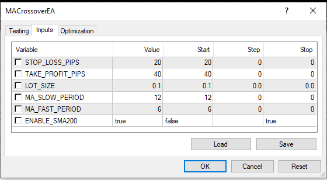

# MACrossoverEA

MACrossoverEA is a simple expert Advisor that opens an order at the crossover of a fast moving average with a slow moving average.

**Entry Signal:**

+ BUY when the fast moving average crosses the slow from the bottom
+ SELL when the fast moving average crosses the slow from the top

**Exit:**

+ Fixed Take Profit
+ Fixed Stop Loss

There is also an optional SMA200 confirmation that you can turn on and off

## Installation

+ Copy the mq4 file in the Metatrader data folder > MQL4 > Experts
and > MQL4 > Include

+ Open the file with Metaeditor
+ Compile the file and restart Metatrader